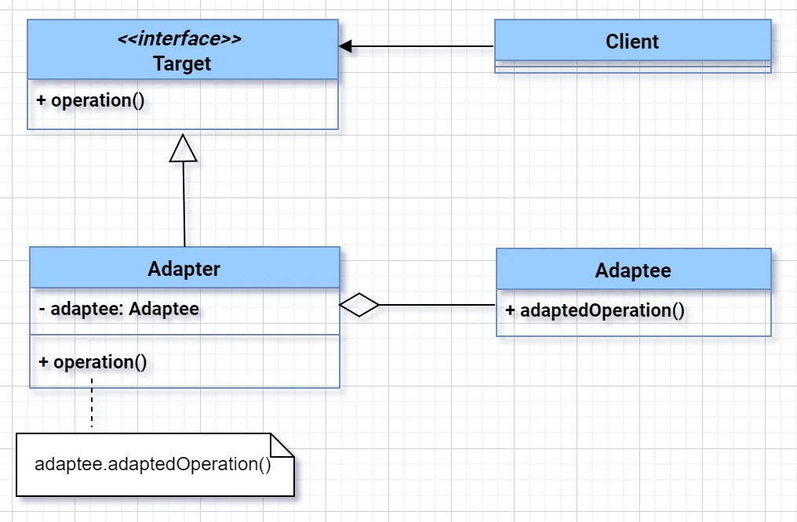

# Adapter Design Pattern
The **Adapter Design Pattern** was introduced to solve this core problem:
> 🔹 **Incompatibility between interfaces of two systems** that need to work together.

## 💡 Real Motivation:
When integrating legacy code or third-party libraries with your current system, their interfaces might not match what your system expects. Instead of modifying existing code (which may not be possible or safe), you **wrap the incompatible class with an adapter** to make it "fit."

### Problem:
- Imagine that you’re creating a stock market monitoring app. The app downloads the stock data from multiple sources in XML format and then displays nice-looking charts and diagrams for the user.
- At some point, you decide to improve the app by integrating a smart 3rd-party analytics library. But there’s a catch: the analytics library only works with data in JSON format.
- You could change the library to work with XML. However, this might break some existing code that relies on the library. And worse, you might not have access to the library’s source code in the first place, making this approach impossible.

### Solution:
- You can create an adapter. This is a special object that converts the interface of one object so that another object can understand it.
- An adapter wraps one of the objects to hide the complexity of conversion happening behind the scenes. The wrapped object isn’t even aware of the adapter. For example, you can wrap an object that operates in meters and kilometers with an adapter that converts all of the data to imperial units such as feet and miles.
- To solve the dilemma of incompatible formats, you can create XML-to-JSON adapters for every class of the analytics library that your code works with directly. Then you adjust your code to communicate with the library only via these adapters. When an adapter receives a call, it translates the incoming XML data into a JSON structure and passes the call to the appropriate methods of a wrapped analytics object.

---

### 🚀 One-liner Purpose:
> **Adapter converts one interface into another expected by the client without altering the existing code.**

---

### ✅ Key Benefits (Interview Keywords):
- Promotes **code reusability**
- Enables **integration of incompatible interfaces**
- Follows **Open/Closed Principle**
- Helps with **legacy system upgrades**

---

---

### 🛠️ Real-World Example:
You use a **third-party payment API** that returns data in its own format (`ThirdPartyPaymentResponse`), but your system expects a custom DTO (`PaymentResponse`).

Instead of modifying either, you write an **adapter** to bridge the gap.

---

### ✅ Goal:
- Convert `ThirdPartyPaymentResponse` to `PaymentResponse` using an adapter.
- Weighing machine pound and kg example is on similar note that is implemented in folders
---

### 🔧 Code Example:
#### Step 1: Internal DTO

```java
public class PaymentResponse {
    private String transactionId;
    private double amount;

    public PaymentResponse(String transactionId, double amount) {
        this.transactionId = transactionId;
        this.amount = amount;
    }

    @Override
    public String toString() {
        return "PaymentResponse{transactionId='" + transactionId + "', amount=" + amount + "}";
    }
}
```

---

#### Step 2: Third-party DTO

```java
public class ThirdPartyPaymentResponse {
    private String txnRef;
    private String totalAmount;

    public ThirdPartyPaymentResponse(String txnRef, String totalAmount) {
        this.txnRef = txnRef;
        this.totalAmount = totalAmount;
    }

    public String getTxnRef() {
        return txnRef;
    }

    public String getTotalAmount() {
        return totalAmount;
    }
}
```

---

#### Step 3: Adapter Interface

```java
public interface PaymentAdapter {
    PaymentResponse convert(ThirdPartyPaymentResponse thirdPartyResponse);
}
```

---

#### Step 4: Adapter Implementation

```java
public class ThirdPartyPaymentAdapter implements PaymentAdapter {

    @Override
    public PaymentResponse convert(ThirdPartyPaymentResponse thirdPartyResponse) {
        return new PaymentResponse(
            thirdPartyResponse.getTxnRef(),
            Double.parseDouble(thirdPartyResponse.getTotalAmount())
        );
    }
}
```

---

#### Step 5: Client Code with `main()`

```java
public class AdapterPatternDemo {

    public static void main(String[] args) {
        // Step A: Simulate third-party response
        ThirdPartyPaymentResponse thirdParty = new ThirdPartyPaymentResponse("TXN999", "599.99");

        // Step B: Use Adapter
        PaymentAdapter adapter = new ThirdPartyPaymentAdapter();
        PaymentResponse response = adapter.convert(thirdParty);

        // Step C: Output result
        System.out.println(response); // Output: PaymentResponse{transactionId='TXN999', amount=599.99}
    }
}
```

---

### 🧠 Interview Highlight:
> "We cleanly convert third-party data to our internal structure using an interface-based adapter — supporting scalability, testability, and adherence to SOLID principles."

---


## Relations with Other Patterns
1. Adapter and Decorator
   - Adapter(Purpose: Convert interface): You have a ThirdPartyPaymentResponse that your system can't understand. So, you adapt it into a PaymentResponse.
   - Decorator(Purpose: Keeps the same interface, extends behavior): You already have a PaymentService. You want to add logging without modifying it — so you wrap it using a decorator.
2. Adapter and  Bridge
   - If I'm integrating an external or legacy system, I use Adapter. If I’m designing from scratch and want abstraction and implementation to evolve independently — for example, shapes and rendering strategies — I use Bridge.
3. Adapter and Proxy 
    - I choose Adapter to integrate incompatible systems (e.g., legacy API to modern DTO). I use Proxy when I need to add access control, lazy loading, or cross-cutting concerns (e.g., logging or caching) while keeping the interface the same.
4. Adapter vs Facade
    - If I need to convert a 3rd-party payment response into my DTO, I use an Adapter. If I want to provide a clean service interface that internally calls multiple modules like inventory, pricing, and payments, I use a Facade. Basically Facade solves complexity overload(hides the mess).