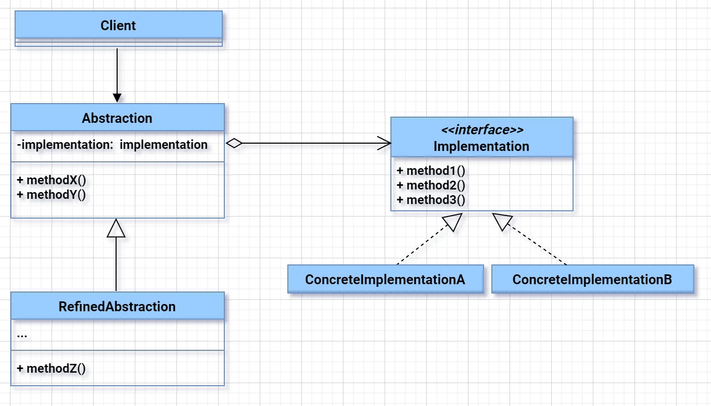
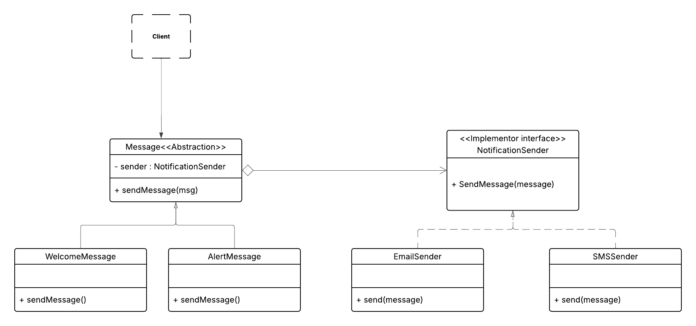

# Bridge Pattern
The Bridge Design Pattern is a structural pattern that separates the abstraction (interface) from its implementation so that both can vary independently. It is used to avoid a permanent binding between an abstraction and its implementation, allowing them to evolve independently.

---

---
### ✅ Real-World Software Problem
#### Good example for keerti video also where uber eats and uber rider uses navigation syatem of googlemap and applemap
#### 🏢 Scenario: **Notification System for an Enterprise App**

Your system needs to **send notifications** to users via:

- 📩 Email
- 📱 SMS
- 📲 Push Notifications

Now your app supports **different types of messages**:

- Welcome message
- Alert message
- Transactional message

---

#### ❌ The Wrong Approach (without Bridge)

If you tightly couple the message logic with delivery method, you'll end up with:

- `WelcomeEmailSender`
- `WelcomeSMSSender`
- `AlertEmailSender`
- `AlertPushSender`
- … and so on

This leads to a **class explosion** — 3 types of messages × 3 delivery methods = 9 classes already!

Every new message type or new channel = exponential growth.

---

### ✅ The Right Approach: **Bridge Pattern**

#### 🔷 Break the system into 2 dimensions:

1. **Abstraction**: Message Type
    - `WelcomeMessage`, `AlertMessage`, etc.

2. **Implementation**: Notification Channel
    - `EmailSender`, `SMSSender`, `PushSender`

#### 🔄 Use composition — message **HAS-A** sender

---

---

### 💻 Code Example in Java

#### 1. **Implementor Interface**
```java
interface NotificationSender {
    void send(String message);
}
```

#### 2. **Concrete Implementors**
```java
class EmailSender implements NotificationSender {
    public void send(String message) {
        System.out.println("Sending EMAIL: " + message);
    }
}

class SMSSender implements NotificationSender {
    public void send(String message) {
        System.out.println("Sending SMS: " + message);
    }
}
```

#### 3. **Abstraction**
```java
abstract class Message {
    protected NotificationSender sender;

    public Message(NotificationSender sender) {
        this.sender = sender;
    }

    abstract void sendMessage(String content);
}
```

#### 4. **Refined Abstractions**
```java
class WelcomeMessage extends Message {
    public WelcomeMessage(NotificationSender sender) {
        super(sender);
    }

    public void sendMessage(String content) {
        sender.send("Welcome: " + content);
    }
}

class AlertMessage extends Message {
    public AlertMessage(NotificationSender sender) {
        super(sender);
    }

    public void sendMessage(String content) {
        sender.send("ALERT: " + content);
    }
}
```

#### ✅ Usage
```java
public class Main {
    public static void main(String[] args) {
        NotificationSender email = new EmailSender();
        NotificationSender sms = new SMSSender();

        Message welcomeEmail = new WelcomeMessage(email);
        welcomeEmail.sendMessage("User A");

        Message alertSMS = new AlertMessage(sms);
        alertSMS.sendMessage("System down!");
    }
}
```

---

### 🎯 Key Takeaways (Interview Level)

- ✅ **Bridge decouples Message logic from Delivery logic**
- ✅ Enables **independent evolution** of message types and delivery channels
- ✅ Prevents **class explosion**
- ✅ Improves **extensibility** and **testability**

---

## Relations with Other Patterns

Awesome. Let’s now **compare Bridge, Strategy, and Adapter patterns** using the **same Notification System context**, so you get a deep and crystal-clear understanding — tailored for a **5-year experienced engineer**.

---

## ✅ 1. **Bridge Pattern** (already covered)

### **Intent**:
**Decouple abstraction from implementation** so they can evolve independently.

### **In our case**:
- `Message` (abstraction) is decoupled from `NotificationSender` (implementation).
- You can add new messages or new senders without changing the other.

🔁 **Abstraction HAS-A Implementor**

---

## 🔁 2. **Strategy Pattern**

### **Intent**:
**Encapsulate interchangeable algorithms (strategies)** and make them pluggable.

### **How it's different?**
Here, you're not splitting abstraction from implementation — you're plugging in **different behavior** at runtime.

---

### **In our case (Strategy version):**

Let’s say you just have one message type — `NotificationMessage` — and you want to **change how it is sent dynamically**.

```java
interface SendingStrategy {
    void send(String message);
}

class EmailStrategy implements SendingStrategy {
    public void send(String message) {
        System.out.println("Email: " + message);
    }
}

class SMSStrategy implements SendingStrategy {
    public void send(String message) {
        System.out.println("SMS: " + message);
    }
}

class NotificationMessage {
    private SendingStrategy strategy;

    public NotificationMessage(SendingStrategy strategy) {
        this.strategy = strategy;
    }

    public void send(String content) {
        strategy.send(content);
    }

    public void setStrategy(SendingStrategy strategy) {
        this.strategy = strategy;
    }
}
```

#### ✅ Usage:
```java
NotificationMessage msg = new NotificationMessage(new EmailStrategy());
msg.send("Welcome!");

msg.setStrategy(new SMSStrategy());
msg.send("System Alert!");
```

### 🔥 Difference:
- Strategy focuses on **interchanging algorithms** (sending logic).
- No concept of abstraction vs implementation.
- You're not modeling message types like `WelcomeMessage`, just the **strategy of how to send**.

---

## 🔁 3. **Adapter Pattern**

### **Intent**:
**Convert one interface into another** expected by the client.

### **When needed?**
When your system expects `NotificationSender`, but you have a legacy system or a third-party API that doesn’t match that interface.

---

### **In our case (Adapter version):**

Say you have a **legacy push service**:

```java
class LegacyPushService {
    public void triggerPush(String msg) {
        System.out.println("Push sent: " + msg);
    }
}
```

But your system expects:

```java
interface NotificationSender {
    void send(String message);
}
```

So you write an **Adapter**:

```java
class PushAdapter implements NotificationSender {
    private LegacyPushService legacyPush;

    public PushAdapter(LegacyPushService legacyPush) {
        this.legacyPush = legacyPush;
    }

    public void send(String message) {
        legacyPush.triggerPush(message);
    }
}
```

Now you can use it like this:

```java
NotificationSender pushSender = new PushAdapter(new LegacyPushService());
Message alert = new AlertMessage(pushSender);
alert.sendMessage("Server down!");
```

---

## 🧠 Summary Table

| Pattern     | Use Case                                                | Key Role            | Focus                          |
|-------------|----------------------------------------------------------|---------------------|--------------------------------|
| **Bridge**  | Vary abstraction & implementation independently          | Has-a               | Separate dimensions            |
| **Strategy**| Swap algorithms/behaviors dynamically                   | Plug-in behavior    | Interchange logic at runtime   |
| **Adapter** | Work with incompatible interface (legacy or third-party) | Convert interface   | Compatibility                  |

---

Let me know if you want a visual comparison diagram too — or a quick quiz-style summary to test your grasp!