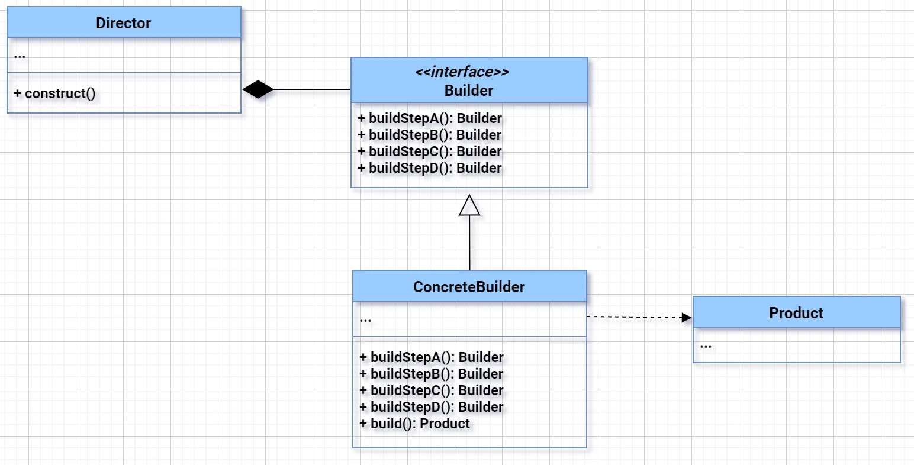
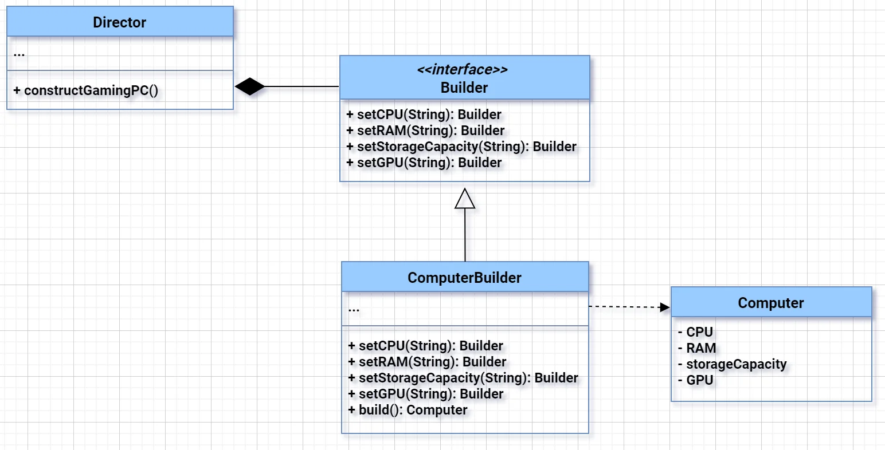

# Builder Design Pattern
The Builder Design Pattern is a creational design pattern that provides a way to construct a complex object step by step. It separates the construction of a complex object from its representation, allowing the same construction process to create different representations. In simpler words, imagine you are building a house. Instead of directly creating the house by specifying all the details in one go, you use a builder to gradually build it. You start with the foundation, then add walls, doors, windows, and so on, until you have a fully constructed house. The builder pattern helps you build different types of houses using the same construction process.

### 🔧 Why Builder Pattern Came into the Picture?

Imagine you're ordering a **burger** 🍔 at a restaurant:

- Sometimes, you want **just a plain burger**.
- Other times, you want to **customize**:
  - Add cheese 🧀  
  - Add lettuce 🥬  
  - No onions ❌🧅  
  - Double patty 🍖🍖  
  - And so on...

Now imagine if the restaurant had **one constructor** for every combination of these things. That would be:

- Constructor with cheese and lettuce
- Constructor with double patty and no onions
- Constructor with cheese only
- … It’d be a mess! Too many constructors. 😩

💡 **Builder pattern** solves this by letting you **build** your burger step by step, like:

```java
Burger myBurger = new Burger.Builder()
    .withCheese()
    .withoutOnions()
    .withDoublePatty()
    .build();
```

You get flexibility, readability, and **no need for 100 constructors**.

---

### 🧠 Now, Interview-Ready Java Summary:

- **Builder Pattern came into picture to simplify object creation in a **step-by-step** way when a class has many optional fields.**  
- It avoids constructor **overload hell** and improves code readability and maintainability.
- Often used in **POJOs, DTOs**, and frameworks like **Lombok**, **Jackson**, **Spring**.

---

## UML class diagram for Builder

### ✅ High-Level Classes in the Diagram

1. **Director**
2. **Builder (interface)**
3. **ConcreteBuilder (implements Builder)**
4. **Product**

---

### 🔍 ARROW EXPLANATIONS (From your diagram)

---

#### 1. `Director ◆───> Builder`

- **Arrow**: Solid line with a **black diamond** at `Director`'s end.
- **Type**: **Composition**
- **Meaning**:  
  - `Director` has a **strong ownership** over `Builder`.  
  - If `Director` is destroyed, it will also clean up the `Builder` reference.  
  - Lifecycle of `Builder` is tightly coupled with `Director`.

🧠 Think: A **Director cannot work without a Builder**.

---

#### 2. `ConcreteBuilder ──▷ Builder`

- **Arrow**: **Solid line** with a **hollow triangle** pointing to `Builder`.
- **Type**: **Generalization / Inheritance**
- **Meaning**:  
  - `ConcreteBuilder` **implements** or **extends** the `Builder` interface.

🧠 Think: `ConcreteBuilder` **is a** `Builder`.

---

#### 3. `ConcreteBuilder - - - - - > Product`

- **Arrow**: **Dashed line** (dependency) pointing from `ConcreteBuilder` to `Product`.
- **Type**: **Dependency**
- **Meaning**:  
  - `ConcreteBuilder` **uses** or **returns** a `Product`.
  - **Loose relationship** — `Product` is used temporarily, likely returned from `build()`.

🧠 Think: `ConcreteBuilder` **creates** and returns the `Product`.

---

### 🧠 Summary for Interview

| Relationship         | Arrow in Diagram      | Meaning                                   |
|----------------------|------------------------|--------------------------------------------|
| Composition          | `◆───>`                | Director owns Builder strongly             |
| Inheritance          | `──▷`                  | ConcreteBuilder implements Builder         |
| Dependency (uses)    | `- - - - >`            | ConcreteBuilder returns or uses Product    |

---

### ☕ Layman Explanation of Builder Pattern Class Diagram

Think of building a **house**:

- You have a **House** (final product).
- You need a **Builder** (who knows how to build it).
- You can have **different types of Builders** (wooden house, glass house, etc.).
- You might have a **Director** (like a project manager) who knows the steps but not the details.

---
### 🧠 Interview-Ready Mapping in Java

#### 1. **Product**  
```java
public class House {
    String walls;
    String roof;
}
```

#### 2. **Builder Interface**
```java
interface HouseBuilder {
    void buildWalls();
    void buildRoof();
    House getHouse();
}
```

#### 3. **Concrete Builder**
```java
public class WoodenHouseBuilder implements HouseBuilder {
    private House house = new House();

    public void buildWalls() {
        house.walls = "Wooden Walls";
    }

    public void buildRoof() {
        house.roof = "Wooden Roof";
    }

    public House getHouse() {
        return house;
    }
}
```

#### 4. **Director**
```java
public class Engineer {
    private HouseBuilder builder;

    public Engineer(HouseBuilder builder) {
        this.builder = builder;
    }

    public House constructHouse() {
        builder.buildWalls();
        builder.buildRoof();
        return builder.getHouse();
    }
}
```

#### 5. **Client**
```java
public class Client {
    public static void main(String[] args) {
        HouseBuilder builder = new WoodenHouseBuilder();
        Engineer engineer = new Engineer(builder);
        House house = engineer.constructHouse();
        // house is ready!
    }
}
```
---

## Computer Builder Example:-


---

### Components:
1. Director:
    - constructGamingPC(builder) method: Orchestrates the construction of a specific type of computer (e.g., gaming PC) using the provided builder.
2. Builder: – Interface with methods:
    - setCPU(String): Sets the CPU of the computer.
    - setRAM(String): Sets the RAM of the computer.
    - setStorageCapacity(int): Sets the storage capacity of the computer.
    - setGPU(String): Sets the GPU of the computer.

3. ComputerBuilder: 
    -  Concrete builder class implementing the Builder interface. – Keeps track of the components needed to build a computer (CPU, RAM, storageCapacity, GPU).
    - build() method: Creates and returns a Computer object with the configured components.

4. Computer: 
    - Product class representing the complex object being constructed. – Has private fields for CPU, RAM, storage capacity, and GPU.

5. Main: 
    - Contains the main() method to demonstrate the usage of the Builder Design Pattern by creating a Director, a ComputerBuilder, and constructing a specific type of computer (e.g., gaming PC).

In summary, the Director guides the construction process using the Builder interface, and the Concrete Builder (ComputerBuilder) implements the steps to construct a Computer. The Computer class represents the final product, and the Main class demonstrates the interaction between the Director, Builder, and Product to create a specific type of computer.


This way, you can create a computer with only the necessary parameters and set optional parameters as needed. The builder pattern helps improve the readability and maintainability of your code, especially when dealing with complex object creation.