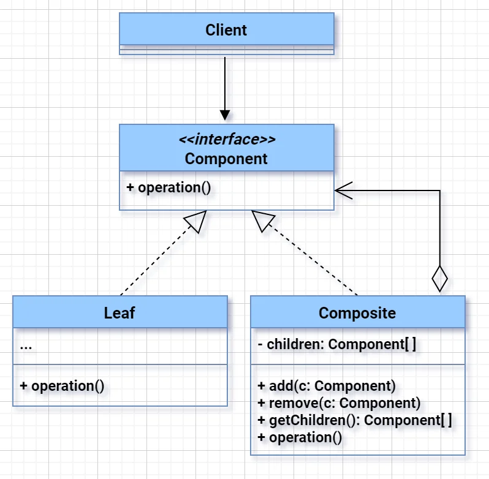
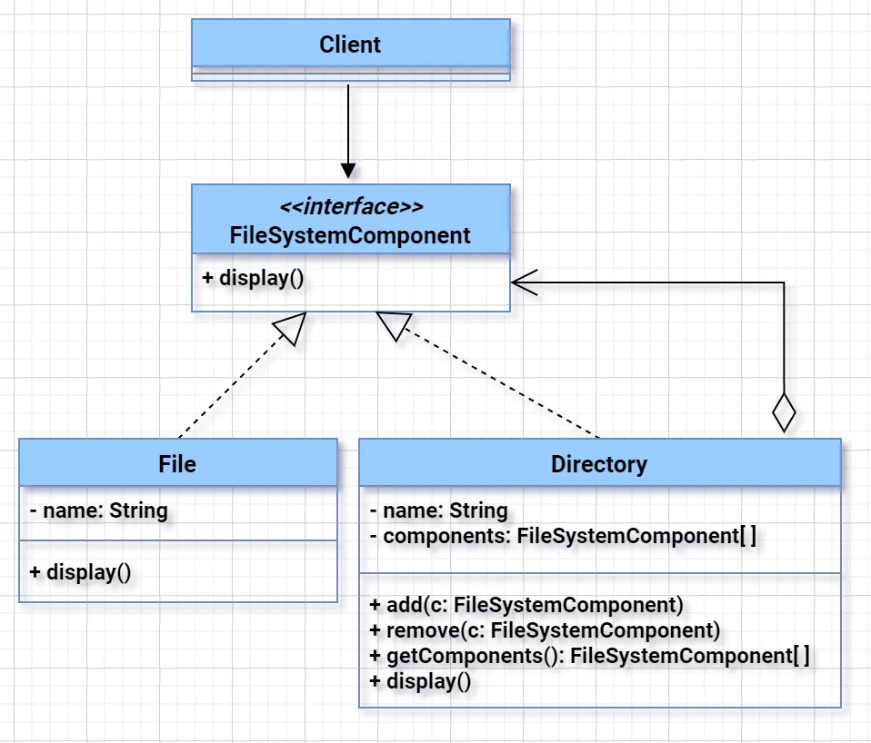

# Composite Pattern

**"Composite Pattern** composes objects into tree structures to represent part-whole hierarchies and lets clients treat individual objects and compositions uniformly."

---

### 🧱 **Key Participants**
1. **Component** – common interface for all objects in the composition
2. **Leaf** – represents leaf objects (no children)
3. **Composite** – represents nodes with children, implements child-related operations

---

---

---

### 👨‍💻 **Java Example (File System Simulation)**

```java
interface FileSystem {
    void ls();
}

class File implements FileSystem {
    private String name;
    public File(String name) { this.name = name; }

    public void ls() {
        System.out.println("File: " + name);
    }
}

class Directory implements FileSystem {
    private String name;
    private List<FileSystem> children = new ArrayList<>();

    public Directory(String name) { this.name = name; }

    public void add(FileSystem fs) {
        children.add(fs);
    }

    public void ls() {
        System.out.println("Directory: " + name);
        for (FileSystem fs : children) {
            fs.ls();
        }
    }
}
```

**Usage:**
```java
public class Main {
    public static void main(String[] args) {
        FileSystem file1 = new File("a.txt");
        FileSystem file2 = new File("b.txt");

        Directory dir = new Directory("MyFolder");
        dir.add(file1);
        dir.add(file2);

        dir.ls(); // Will print all files in the directory
    }
}
```

---

### 🧠 **When to Use**
- You have a **tree structure** (like UI components, file system, etc.)
- You want **uniform access** to leaf and composite objects
- You want to **reduce client-side complexity**

---

### 💡 Real-World Examples
- GUI frameworks (buttons inside panels inside windows)
- File systems (files and folders)
- HTML/XML DOM trees

---

### 📦 Benefits
- Simplifies client code
- Makes the tree structure flexible
- Supports **recursive** structures

## Relations with Other Patterns
- Composite: A Folder can contain Files and other Folders. You treat a Folder and a File the same way — e.g., call ls() on both.
- Decorator: A TextFile can be decorated with a ScrollDecorator or BorderDecorator to add scrolling or borders, without modifying the original object.
- A Decorator is like a Composite but only has one child component. There’s another significant difference: Decorator adds additional responsibilities to the wrapped object, while Composite just “sums up” its children’s results.