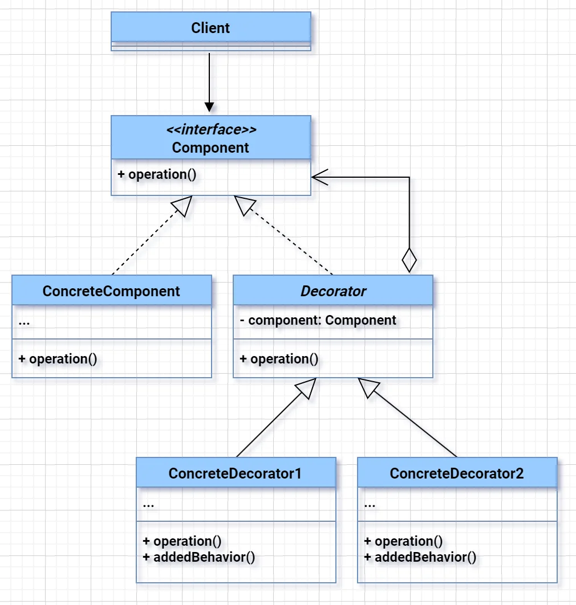
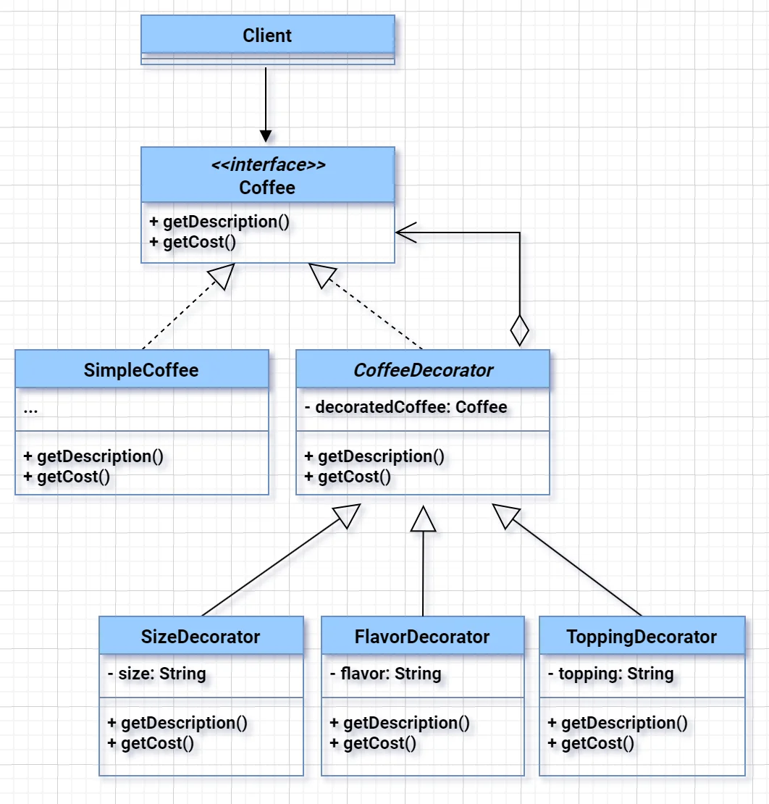

# Decorator Design Pattern
**Decorator Pattern** is needed when you want to **add behavior to objects dynamically** without modifying their code or using inheritance.

---

### ✅ **Why is Decorator Pattern needed?**
- To **extend functionalities at runtime**. The client can decorate the object with any custom decorators, as long as they follow the same interface as the others.
- To follow **Open/Closed Principle** – open for extension, closed for modification.
- To **avoid large inheritance trees** when functionalities are combinational.
- To **add features selectively** to individual objects, not the whole class.

---

---

---

### 🎯 **Case where only Decorator helps:**
#### Real-world Example:
Wearing clothes is an example of using decorators. When you’re cold, you wrap yourself in a sweater. If you’re still cold with a sweater, you can wear a jacket on top. If it’s raining, you can put on a raincoat. All of these garments “extend” your basic behavior but aren’t part of you, and you can easily take off any piece of clothing whenever you don’t need it.

#### 🔸**Java I/O Streams**
You want to read a file with buffering and compression:
```java
InputStream input = new FileInputStream("file.txt");
InputStream buffered = new BufferedInputStream(input);
InputStream compressed = new GZIPInputStream(buffered);
```
- Here, `BufferedInputStream` and `GZIPInputStream` **decorate** the `FileInputStream`.
- Each adds behavior **without changing** the base class.

✅ **Only Decorator helps here** because:
- You can **mix & match** features at runtime (`buffered`, `gzip`, `encryption`, etc.).
- Inheritance can't support **dynamic composition** like this.

---

### 🔸 **Custom Case: Pizza Toppings Example**
```java
interface Pizza {
    String getDescription();
    int getCost();
}

class PlainPizza implements Pizza {
    public String getDescription() { return "Plain Pizza"; }
    public int getCost() { return 100; }
}

class CheeseDecorator implements Pizza {
    private Pizza pizza;
    public CheeseDecorator(Pizza pizza) { this.pizza = pizza; }

    public String getDescription() { return pizza.getDescription() + ", Cheese"; }
    public int getCost() { return pizza.getCost() + 20; }
}
```
Now, toppings can be **stacked dynamically**:
```java
Pizza pizza = new CheeseDecorator(new PlainPizza());
```

---

### 🔚 **Summary One-liner (for interview):**
> Decorator Pattern is used when behavior needs to be added dynamically and selectively to individual objects without changing the original class or creating an explosion of subclasses.

### Relations with Other Patterns
- Use Adapter when you need to make incompatible interfaces work together without modifying existing code.
- Use Decorator when you need to add or enhance behavior of objects dynamically, without altering the original class.
- Use when you want to control access to the real object (e.g., for security, logging, caching, or lazy initialization) but don’t add new features inside.