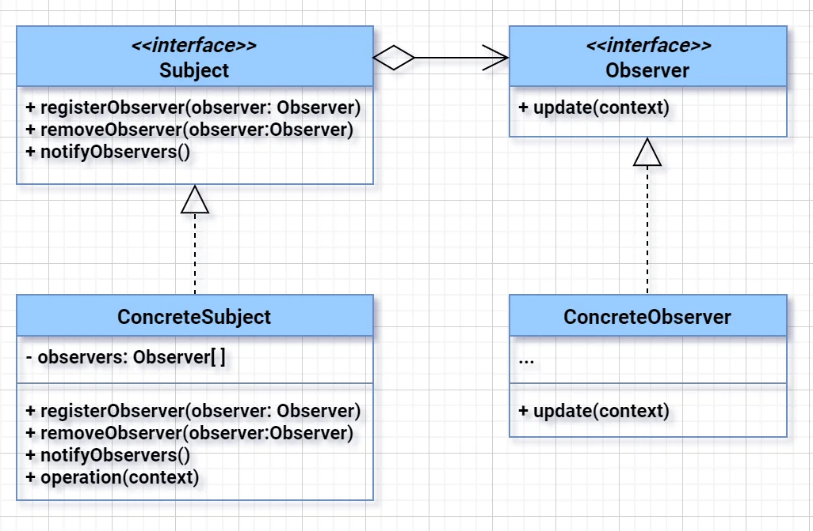
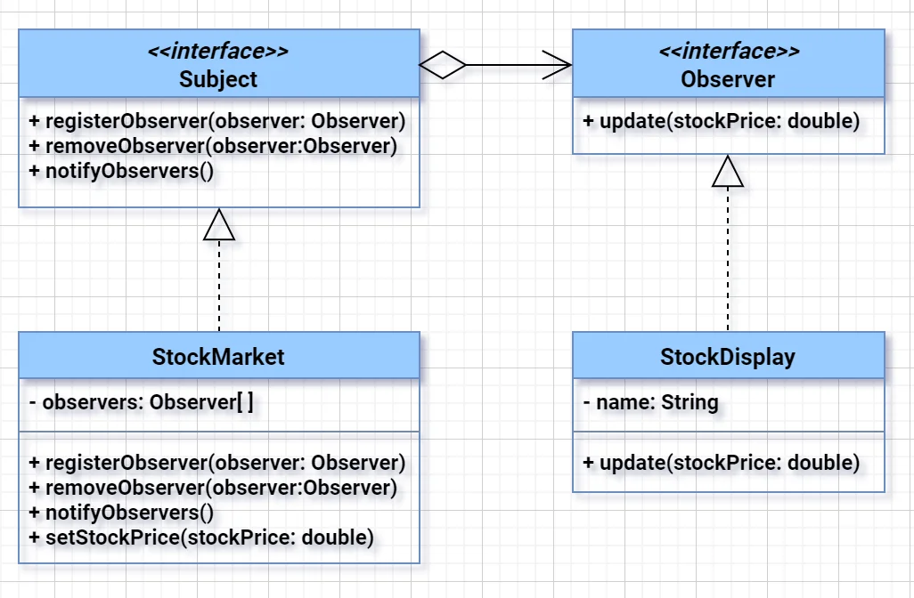

# Observer Design Pattern

Observer is a behavioral design pattern that lets you define a subscription mechanism to notify multiple objects about any events that happen to the object they’re observing. This pattern is widely used to implement distributed event-handling systems.

### ✅ Real-world software scenario (Observer Pattern must be used):
 - read example from here too https://refactoring.guru/design-patterns/observer

#### **Scenario: Email Notification System in an E-Commerce Platform**

##### Problem Statement:
You're building an e-commerce platform. When an **order status changes**, multiple systems must be notified:
- **Customer Notification Service** (sends email/SMS)
- **Inventory Service** (to update stock)
- **Shipping Service** (to start shipping process)
- **Analytics Service** (for event logging)

> Only the observer pattern can cleanly solve this problem — otherwise, you'll tightly couple all systems, making the `OrderService` huge and rigid.

---

### ✅ Why only Observer can fix this?

- **Loose Coupling:** `OrderService` doesn't need to know about `EmailService`, `InventoryService`, etc.
- **Dynamic Observers:** New observers can be added at runtime (e.g., `RecommendationEngine`) without touching `OrderService`.
- **Single Responsibility:** `OrderService` only deals with order logic, not with external notifications.

---

---

---

## Components: 
1. **Subject:** This is the object that is being observed. It maintains a list of its dependents, known as observers, and notifies them of state changes.
2. **Observer:** This is the interface that defines the update method, which is called by the subject to notify the observer of a state change.
3. **ConcreteSubject:** This is a concrete implementation of the subject. It contains the actual state and notifies observers when the state changes.
4. **ConcreteObserver:** This is a concrete implementation of the observer. It registers interest with the subject to receive updates and implements the update method.

### Example stock market
Consider a stock market application where various components, such as graphical displays or analytics tools, need to be updated whenever the stock prices change. Without the Observer pattern, you might end up with tight coupling between the components that need to be updated and the code that changes the stock prices.

### ✅ Code Example (Java):

```java
// 1. Subject.java
import java.util.ArrayList;
import java.util.List;

public interface Subject {
    void registerObserver(Observer observer);
    void removeObserver(Observer observer);
    void notifyObservers();
}

// 2. Concrete subject (StockMarket.java)
import java.util.ArrayList;
import java.util.List;

public class StockMarket implements Subject {
    private List<Observer> observers;
    private double stockPrice;

    public StockMarket() {
        this.observers = new ArrayList<>();
    }

    public void setStockPrice(double price) {
        this.stockPrice = price;
        notifyObservers();
    }

    @Override
    public void registerObserver(Observer observer) {
        observers.add(observer);
    }

    @Override
    public void removeObserver(Observer observer) {
        observers.remove(observer);
    }

    @Override
    public void notifyObservers() {
        for (Observer observer : observers) {
            observer.update(stockPrice);
        }
    }
}

public class InventoryService implements OrderObserver {
    public void update(Order order) {
        System.out.println("Inventory updated for order: " + order.getId());
    }
}

// 3. Observer.java
public interface Observer {
    void update(double stockPrice);
}

// 4. Concrete Observer (StockDisplay.java)
public class StockDisplay implements Observer {
    private String name;

    public StockDisplay(String name) {
        this.name = name;
    }

    @Override
    public void update(double stockPrice) {
        System.out.println(name + " received an update: Stock price is now $" + stockPrice);
    }
}
// 5. Main.java
public class Main {
    public static void main(String[] args) {
        StockMarket stockMarket = new StockMarket();

        StockDisplay display1 = new StockDisplay("Display 1");
        StockDisplay display2 = new StockDisplay("Display 2");

        stockMarket.registerObserver(display1);
        stockMarket.registerObserver(display2);

        // Simulate stock price changes
        stockMarket.setStockPrice(150.50);
        stockMarket.setStockPrice(155.75);

        // Display 1 and Display 2 will receive updates automatically
    }
}


```

### Relations with Other Patterns

Here’s how the **Observer Design Pattern** relates to other design patterns — useful for both understanding and interview insights:

---

### 🔄 **Relations with Other Patterns**

| Related Pattern      | Relationship / Comparison                                                                 |
|----------------------|--------------------------------------------------------------------------------------------|
| **Mediator**         | Mediator centralizes complex communications; Observer allows direct notification to subscribers. Use Mediator when interaction logic is complex. |
| **Publisher–Subscriber (Pub-Sub)** | Observer is a simplified version. In Pub-Sub, the publisher and subscriber don’t know each other — often uses a message broker (decoupled even further). |
| **Strategy**         | Both use composition and interfaces, but Strategy is about choosing **how to behave**, while Observer is about **who to notify**. |
| **Decorator**        | Decorator adds behavior **dynamically** to objects; Observer adds behavior by **attaching listeners**. |
| **Command**          | Commands can be used as callbacks (like Observers) but are more about encapsulating requests. |
| **EventBus / Event Queue** | Modern implementations (like in Java, Spring, or JS) often use Observer pattern underneath. These abstract or scale the pattern. |
| **MVC (Model-View-Controller)** | The **View** is an Observer of the **Model**. When model data changes, the view is updated — classic Observer usage. |

---

### 🧠 Interview One-Liner:

> "Observer is a core pattern often embedded within MVC, Pub-Sub, and EventBus architectures — enabling reactive design by separating the **what happened** from **who cares**."
