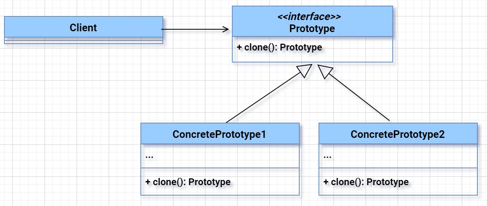

# Prototype Design Pattern
**Prototype Design Pattern** is used when the cost of creating a new object is expensive or complex. Instead of creating a new instance, you **clone an existing one**.

---

### ✅ **Why use Prototype Design Pattern?** *(Concise points for 5 YOE interviews)*

1. **Avoids costly object creation**  
   → Clone instead of building from scratch (e.g., heavy DB or file operations).

2. **Reduces subclassing**  
   → No need to write logic to create object variants in subclasses.

3. **Simplifies object creation**  
   → Especially when object creation involves multiple configurations.

4. **Supports dynamic object creation**  
   → Useful when types are determined at runtime.

5. **Improves performance**  
   → Faster than creating and initializing a new object every time.

---

### ✅ **Real-world analogy:**
Making photocopies instead of writing the same content again.

---

1. Client: The class that requires new objects by cloning existing prototypes.
2. Prototype (Interface/Abstract Class): Declares the clone method, which concrete classes must implement.
3. ConcretePrototype: Classes that implement the clone method to create a new instance of the object.
### ✅ **Example in Java:**
```java
public abstract class Shape implements Cloneable {
    public String type;

    public Shape clone() {
        try {
            return (Shape) super.clone();
        } catch (CloneNotSupportedException e) {
            throw new RuntimeException(e);
        }
    }
}

public class Circle extends Shape {
    public Circle() {
        this.type = "Circle";
    }
}

public class Rectangle extends Shape {
   public Rectangle() {
      this.type = "Rectangle";
   }
}

public class Main {
    public static void main(String[] args) {
        Circle original = new Circle();
        Circle clonedCircle = (Circle) original.clone();

       Rectangle originalRectangle = new Rectangle();
       Rectangle clonedRectangle = (Rectangle) originalRectangle.clone();
       System.out.println(clonedCircle.type); // Output: Circle
       System.out.println(clonedRectangle.type); // Output: Rectangle
    }
}
```

---
### ✅ **Use Case: Document Template System (e.g., MS Word, Confluence)**

#### 🧠 **Problem:**
You’re building a system like **Confluence**, where users can create **custom templates** for reports, tickets, or documentation.  
Creating each document from scratch is time-consuming and repetitive.

---

### ✅ **Solution: Use Prototype Pattern**

- Store a **registry of pre-defined templates** (Prototypes).
- When a user wants a new document, **clone** the selected template.
- Modify the cloned object (like title, content) without touching the original.

---

### ✅ **Java Code Example:**

```java
// Prototype Interface
public interface Document extends Cloneable {
    Document clone();
    void print();
}

// Concrete Prototype
public class ReportTemplate implements Document {
    private String title;
    private String content;

    public ReportTemplate(String title, String content) {
        this.title = title;
        this.content = content;
    }

    public Document clone() {
        return new ReportTemplate(this.title, this.content);
    }

    public void setTitle(String title) { this.title = title; }

    public void print() {
        System.out.println("Title: " + title + "\nContent: " + content);
    }
}

// Prototype Registry
import java.util.HashMap;
import java.util.Map;

public class TemplateRegistry {
    private static Map<String, Document> templates = new HashMap<>();

    public static void addTemplate(String name, Document doc) {
        templates.put(name, doc);
    }

    public static Document getTemplate(String name) {
        return templates.get(name).clone();
    }
}
```

### ✅ **Usage:**

```java
public class Main {
    public static void main(String[] args) {
        ReportTemplate monthly = new ReportTemplate("Monthly Report", "Standard metrics included.");
        TemplateRegistry.addTemplate("monthly", monthly);

        Document myReport = TemplateRegistry.getTemplate("monthly");
        myReport.print();
    }
}
```

---
✅ **Use Case: Game Skin Loading/copying problem**
---

## 🔴 **Without Prototype – Full Code with Timer**

```java
public class GameCharacter {
    private String name;
    private String skin;
    private String weapon;

    public GameCharacter(String name, String skin, String weapon) {
        loadSkin(skin);
        this.name = name;
        this.weapon = weapon;
    }

    private void loadSkin(String skin) {
        try {
            Thread.sleep(1000); // Simulate expensive operation
        } catch (InterruptedException e) {
            e.printStackTrace();
        }
        this.skin = skin;
    }

    public void print() {
        System.out.println("Name: " + name + ", Skin: " + skin + ", Weapon: " + weapon);
    }
}
```

```java
public class MainWithoutPrototype {
    public static void main(String[] args) {
        long start = System.currentTimeMillis();

        for (int i = 1; i <= 5; i++) {
            GameCharacter character = new GameCharacter("Hero" + i, "KnightSkin", "Sword");
            character.print();
        }

        long end = System.currentTimeMillis();
        System.out.println("Total time without prototype: " + (end - start) + " ms");
    }
}
```

---

## ✅ **With Prototype – Full Code with Timer**

```java
public class GameCharacter implements Cloneable {
    private String name;
    private String skin;
    private String weapon;

    public GameCharacter(String name, String skin, String weapon) {
        loadSkin(skin);
        this.name = name;
        this.weapon = weapon;
    }

    private void loadSkin(String skin) {
        try {
            Thread.sleep(1000); // Simulate expensive operation
        } catch (InterruptedException e) {
            e.printStackTrace();
        }
        this.skin = skin;
    }

    public GameCharacter clone() {
        try {
            return (GameCharacter) super.clone(); // shallow copy
        } catch (CloneNotSupportedException e) {
            throw new RuntimeException(e);
        }
    }

    public void setName(String name) {
        this.name = name;
    }

    public void print() {
        System.out.println("Name: " + name + ", Skin: " + skin + ", Weapon: " + weapon);
    }
}
```

```java
public class MainWithPrototype {
    public static void main(String[] args) {
        long start = System.currentTimeMillis();

        // Expensive creation once
        GameCharacter prototype = new GameCharacter("Hero", "KnightSkin", "Sword");

        // Cloning 5 characters
        for (int i = 1; i <= 5; i++) {
            GameCharacter copy = prototype.clone();
            copy.setName("Hero" + i);
            copy.print();
        }

        long end = System.currentTimeMillis();
        System.out.println("Total time with prototype: " + (end - start) + " ms");
    }
}
```

---

### 🧪 Try running both and compare outputs:

- **Without Prototype:** ~5000 ms (1 sec × 5)
- **With Prototype:** ~1000–1100 ms (1 sec load + fast clones)

---