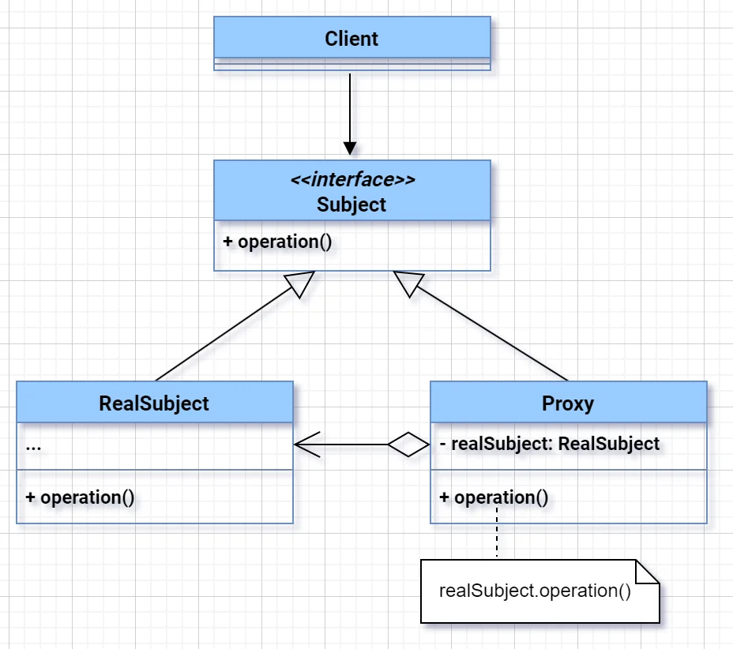
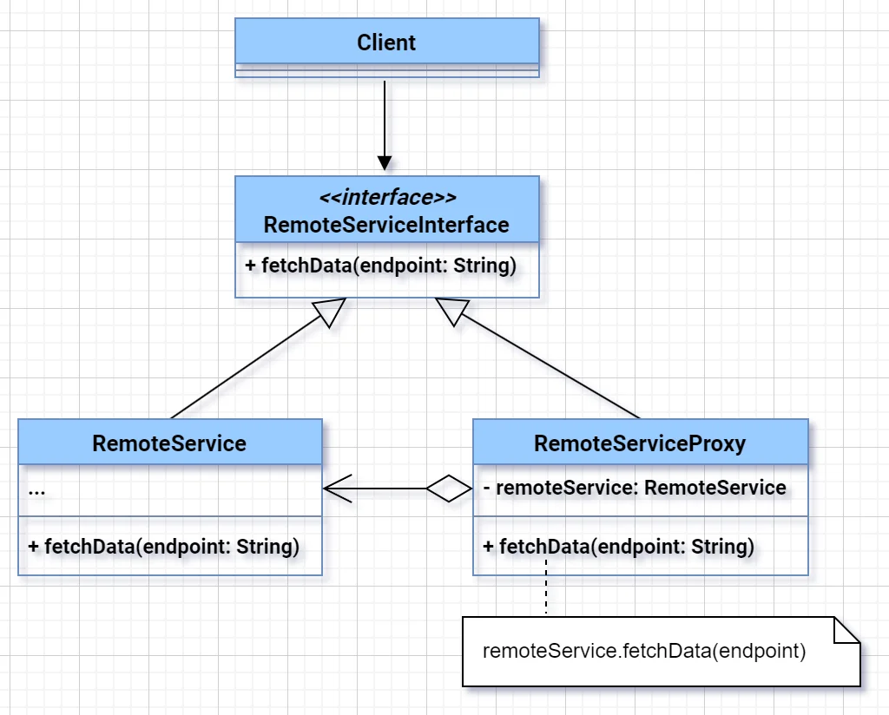

# 🔹 **Proxy Design Pattern – Definition**
> A proxy acts as a **placeholder or surrogate** for another object to **control access** to it.

---

---

---

### 🔹 **Real-World Software Problem**  
**Problem**: In a **remote file server system**, users want to **download files**, but:
- Only **authorized users** should be able to access the files.
- You want to **log** every access for auditing.
- Downloading a large file should be **lazy-loaded** only when accessed.

**Direct access to the `FileServer` class** would not allow you to enforce all these constraints in one place.

---

### 🔹 Why Only Proxy Fixes This?
You cannot **modify the real `FileServer` class** (maybe it’s a third-party or legacy component), and you want to **enforce access control and logging without changing core logic**.

✅ **Solution**: Use **Proxy Pattern**.

---

### 🔹 UML Style
```
Client → FileServerProxy → RealFileServer (target)
```

---

### 🔹 Java Code Example (Access Control + Logging)

```java
interface FileServer {
    void download(String fileName);
}

class RealFileServer implements FileServer {
    public void download(String fileName) {
        System.out.println("Downloading file: " + fileName);
    }
}

class FileServerProxy implements FileServer {
    private RealFileServer realFileServer = new RealFileServer();
    private String userRole;

    public FileServerProxy(String userRole) {
        this.userRole = userRole;
    }

    public void download(String fileName) {
        if (!"ADMIN".equals(userRole)) {
            System.out.println("Access Denied for file: " + fileName);
            return;
        }
        System.out.println("Access Granted. Logging download...");
        realFileServer.download(fileName);
    }
}
```

---

### 🔹 Usage

```java
public class Main {
    public static void main(String[] args) {
        FileServer userProxy = new FileServerProxy("USER");
        userProxy.download("secret.doc");

        FileServer adminProxy = new FileServerProxy("ADMIN");
        adminProxy.download("secret.doc");
    }
}
```

---

### 🔹 Output
```
Access Denied for file: secret.doc
Access Granted. Logging download...
Downloading file: secret.doc
```

---

### 🔹 Real-World Uses
| Use Case | Proxy Type |
|----------|-------------|
| Remote service (RMI) | Remote Proxy |
| Security check | Protection Proxy |
| Lazy object creation | Virtual Proxy |
| Access log | Logging Proxy |

---

### 🔹 Summary One-Liner (For Interview)
> **Proxy pattern** provides a placeholder to control access, log, or lazy-load the real object **without changing its code**, perfect when the original object is **expensive, sensitive, or external**.

---

Want examples of **Virtual Proxy**, **Remote Proxy**, or **Spring AOP** as proxy?