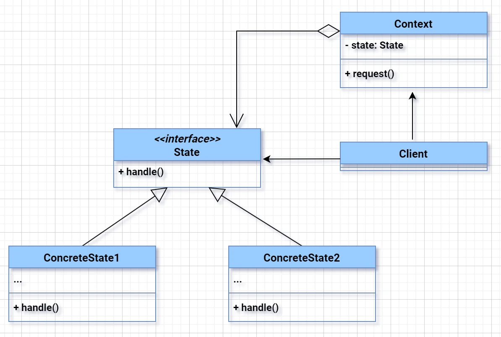

# **State Design Pattern**
> Allows an object to change its behavior when its internal state changes — it appears as if the object changed its class.

---

### 🔹 Real-World Software Problem (Where Only State Pattern Fits)

**Problem Statement:**

You're building a **Document Workflow System** (like Google Docs or Jira ticketing) with the following states:

- **Draft**
- **Moderation**
- **Published**

Each state has different allowed operations:

| State        | Allowed Actions               |
|--------------|-------------------------------|
| Draft        | Edit, Submit for Moderation   |
| Moderation   | Approve, Reject               |
| Published    | Archive                       |

Without State pattern, you’d need **complex if-else chains** or **switch-case**, spread across your service classes.

---

### ✅ Why Only State Pattern Works Well Here:

- You need **polymorphic behavior based on state**.
- State transitions should be **controlled and encapsulated**.
- Adding/removing states should be **scalable**.
- Avoid tight coupling and big switch/if-else statements.

---

### 🔹 UML Diagram (State Pattern)


```
+-------------------+
|     Context       |-----------------+
| - state: State    |                 |
| + setState(s)     |                 |
| + handleAction()  |                 |
+-------------------+                 |
          |                           |
          | has-a                     |
          v                           |
+--------------------+    +---------------------+
|     State (interface)    <|--+ DraftState     |
| + handleAction()         |   +----------------+
+--------------------+     |   | +handleAction()|
                           |   +----------------+
                           |
                           |   +----------------------+
                           +---| ModerationState      |
                           |   +----------------------+
                           |   | +handleAction()      |
                           |
                           |   +-------------------+
                           +---| PublishedState     |
                               +-------------------+
                               | +handleAction()   |
                               +-------------------+
```

---

### 🔹 Text Flow (Big Picture):

```
DocumentContext 
    has-a -> State (current state)
        State interface implemented by -> DraftState / ModerationState / PublishedState
            Each state handles behavior differently
```

---

### 🔹 Java Example (Concise & Interview-Friendly)

```java
// 1. State Interface
interface State {
    void handle(DocumentContext ctx);
}

// 2. Concrete State classes
class DraftState implements State {
    public void handle(DocumentContext ctx) {
        System.out.println("In Draft. Moving to Moderation...");
        ctx.setState(new ModerationState());
    }
}

class ModerationState implements State {
    public void handle(DocumentContext ctx) {
        System.out.println("In Moderation. Moving to Published...");
        ctx.setState(new PublishedState());
    }
}

class PublishedState implements State {
    public void handle(DocumentContext ctx) {
        System.out.println("In Published. Archiving document...");
        // final state
    }
}

// 3. Context class(main Object)
class DocumentContext {
    private State state;

    public DocumentContext() {
        this.state = new DraftState(); // default state
    }

    public void setState(State state) {
        this.state = state;
    }

    public void handleAction() {
        state.handle(this);
    }
}

// 4. Usage
public class StatePatternDemo {
    public static void main(String[] args) {
        DocumentContext doc = new DocumentContext();
        doc.handleAction(); // Draft -> Moderation
        doc.handleAction(); // Moderation -> Published
        doc.handleAction(); // Published -> Archive
    }
}
```

---

### 🔹 Summary Table (Arrows in UML)

| Arrow | Meaning                      | Example                         |
|-------|------------------------------|----------------------------------|
| solid line with open arrowhead | **Implements**              | `DraftState` → `State`         |
| solid line with no arrow      | **has-a / uses**            | `DocumentContext` has `State`  |

---

### 🧠 Interview Insights:

- Use **State Pattern** when object behavior changes based on internal state.
- Avoids **brittle switch-case/if-else**.
- Promotes **Open/Closed Principle** — easy to add new states.
