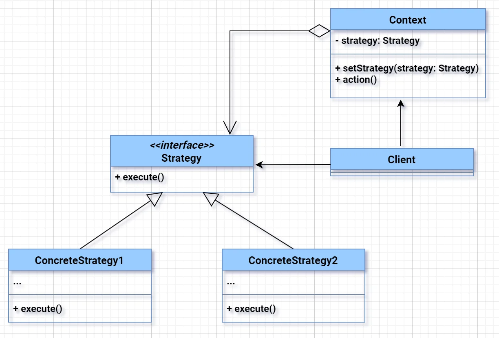
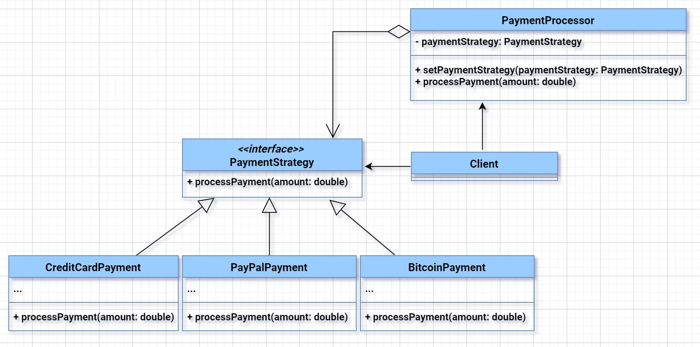

# Strategy Design Pattern
**Strategy Pattern** allows selecting an algorithm's behavior at runtime by defining a family of algorithms, encapsulating each one, and making them interchangeable.


### 🎯 **Real-World Problem – Payment Gateway in E-commerce App**

#### 🧩 Problem Statement:  
You're building a **payment system** that should support multiple payment modes:
- Credit Card  
- UPI  
- NetBanking  
- Wallets  

Now, each payment type:
- Has a **different logic** for validation, transaction processing, and logging.
- May change **independently** (e.g., new rules for credit cards but not UPI).
- Must be **easily extendable** without touching core payment logic.

If you write **if-else or switch** based on `paymentType`, you'll:
- Violate **Open-Closed Principle**  
- Make code **rigid and hard to test**  
- Add bugs when modifying existing logic  

---

---

---

---

## 🎯 Let's Decode the Arrows in Your UML Diagram

### ✅ 1. **Solid Line with Hollow Triangle**
![→] Arrow from `CreditCardPayment` → `PaymentStrategy`  
**Meaning:** *Implements Interface*

- `CreditCardPayment`, `PayPalPayment`, and `BitcoinPayment` all have this arrow pointing to `PaymentStrategy`.
- It means:  
  > “These classes implement the `PaymentStrategy` interface.”

🧠 **Mnemonic:** Hollow triangle = "is-a" relationship  
➡️ CreditCardPayment **is a** PaymentStrategy.

---

### ✅ 2. **Solid Line with No Arrowhead**
![―] Line between `PaymentProcessor` and `PaymentStrategy`  
**Meaning:** *Has-a / Composition or Aggregation*

- `PaymentProcessor` has a **member variable** of type `PaymentStrategy`.
  ```java
  private PaymentStrategy paymentStrategy;
  ```

- So it **uses/contains** a strategy — this is the classic "**has-a**" relationship.

💡 Usually implies **composition** (strong lifecycle tie), but in Strategy pattern, it's often **aggregation** (strategy can be swapped at runtime).

---

### ✅ 3. **Arrow from `Client` to `PaymentProcessor`**
**Meaning:** *Uses / Instantiates / Controls*

- The `Client` class is the one:
  - Creating the processor.
  - Setting the strategy.
  - Calling `processPayment()`.

➡️ So the arrow shows:  
> “Client uses PaymentProcessor.”

---

### ✅ 4. **Arrow from `Client` to `PaymentStrategy`**
**Meaning:** *Uses / Selects Strategy*

- The `Client` **chooses** which concrete strategy to use and passes it to the `PaymentProcessor`.
  ```java
  processor.setPaymentStrategy(new PayPalPayment());
  ```

➡️ So the client **controls the strategy selection**.

---

## 📌 Summary Table of Arrow Meanings

| Arrow Type | From → To | Meaning |
|------------|-----------|---------|
| 🔼 Hollow triangle | `ConcreteClass` → `Interface` | Implements |
| ➖ Solid line | `ClassA` → `ClassB` | Has-a (composition/aggregation) |
| ➡️ Regular arrow | `Client` → `Class` | Uses / Controls |

---

## 🔁 Big Picture Flow

```
Client 
  ↓ (uses)
PaymentProcessor 
  ── has-a ──▶ PaymentStrategy 
                ▲        ▲        ▲
     (implemented by) CreditCard PayPal Bitcoin
```


### ✅ **Strategy Pattern Solution**

#### 🔧 Step-by-step

1. **Define Strategy Interface**  
```java
public interface PaymentStrategy {
    void pay(double amount);
}
```

2. **Implement Strategies**
```java
public class CreditCardPayment implements PaymentStrategy {
    public void pay(double amount) {
        System.out.println("Paid ₹" + amount + " using Credit Card");
    }
}

public class UpiPayment implements PaymentStrategy {
    public void pay(double amount) {
        System.out.println("Paid ₹" + amount + " using UPI");
    }
}

public class NetBankingPayment implements PaymentStrategy {
    public void pay(double amount) {
        System.out.println("Paid ₹" + amount + " using NetBanking");
    }
}
```

3. **Context Class (uses strategy)**
```java
public class PaymentContext {
    private PaymentStrategy strategy;

    public void setStrategy(PaymentStrategy strategy) {
        this.strategy = strategy;
    }

    public void pay(double amount) {
        strategy.pay(amount);
    }
}
```

4. **Usage**
```java
public class PaymentApp {
    public static void main(String[] args) {
        PaymentContext context = new PaymentContext();

        context.setStrategy(new CreditCardPayment());
        context.pay(500.0);  // Output: Paid ₹500.0 using Credit Card

        context.setStrategy(new UpiPayment());
        context.pay(1200.0); // Output: Paid ₹1200.0 using UPI
    }
}
```

---

### 🔥 Why Only Strategy Works Here

- Each payment logic is **isolated** and **independently testable**.
- Adding a new method like `CryptoPayment`? → Just add a new class.
- Core logic never changes – **Open for extension, closed for modification**.
- Runtime selection of strategy — critical in real-world systems.

---

### 🧠 Interview Tip  
> "I use Strategy Pattern when I need to switch between different behaviors or algorithms **at runtime** without changing the client code — perfect for systems like payments, sorting, compression, or routing where behavior varies independently."


### Relation with other Patterns
## 🎯 **When to Use What (Quick Rules)**

- Use **Strategy** when:
  - You need to choose **one of many behaviors**.
  - Behavior needs to be swappable and testable independently.

- Use **Decorator** when:
  - You want to **add new behavior** to objects **dynamically**, like logging or encryption.

- Use **State** when:
  - Object’s behavior depends on its **internal state** (e.g., Order status: NEW → SHIPPED → DELIVERED).

- Use **Command** when:
  - You want to **decouple request from execution**, or need **undo/redo/history** support.

- Use **Template Method** when:
  - You have a **fixed process flow**, but need to let subclasses tweak **some steps**.

- Use **Observer** when:
  - You want **multiple components to react** to a change in one object (like listeners, pub/sub).

---

### 🔧 **Code Relationship Summary**

| Pattern     | Has Interface | Swappable Logic | Runtime Behavior Change | Main Use Case |
|-------------|----------------|------------------|--------------------------|----------------|
| Strategy    | ✅              | ✅               | ✅                       | Multiple algorithms |
| Decorator   | ✅ (or wraps)   | ❌ (adds on)     | ✅                       | Dynamic feature add-ons |
| State       | ✅              | ✅               | ✅ (due to state)        | State-specific behavior |
| Command     | ✅              | ❌               | ✅                       | Task/request encapsulation |
| Template    | ✅ (abstract)   | ❌               | ❌                       | Controlled method overriding |
| Observer    | ✅ (listener)   | ❌               | ✅                       | Event propagation |
